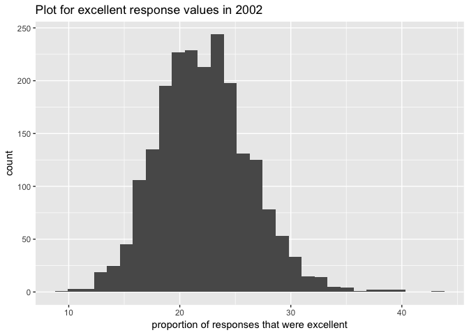
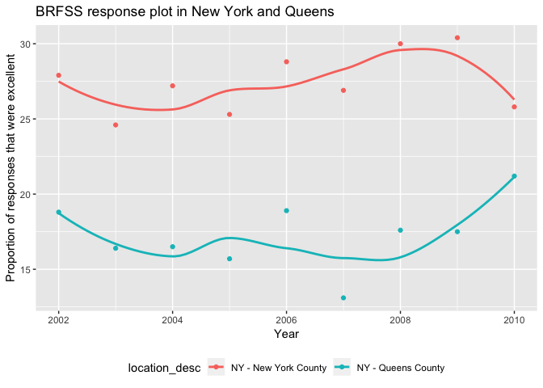

P8105\_hw2\_ym2715
================
Yizhi Ma
10/5/2018

Problem 1
---------

``` r
subway_df = read.csv("./data/NYC_Transit_Subway_Entrance_And_Exit_Data.csv") %>% 
  janitor::clean_names()

subway_tidy_df = subway_df %>% 
  select(line, station_name, station_latitude, station_longitude, entry, vending, entrance_type, ada, route1, route2, route3, route4, route5, route6, route7, route8, route9, route10, route11) %>% 
  distinct() %>% 
  mutate(entry = if_else(entry == "YES", TRUE, FALSE)) # Convert the entry variable from character to a logical variable
```

So far, I've used "janitor::clean\_names" to keep the names consistent among variables. Then I select the variables that I need and use "distinct" to remove rows that are exactly the same.

The current data set -- subway\_tidy\_df -- contains some information about NYC subway system, including lines, different stations on each line with their location expressed in latitude and longitude. It tells us whether the entry is avaliable, which entrence type it is, if there's vending and ADA compliant, and also, which train stops at the stations.

The dataset is now a 684 x 19 table. I name it with "tidy" but I don't think it's tidy enough, the route part seems a little bit annoying.

``` r
subway_tidy_df %>% 
  distinct(line, station_name) %>% 
  nrow()
```

    ## [1] 465

There're 465 subway stations in NYC.

``` r
subway_tidy_df %>% 
  distinct(line, station_name, ada) %>% 
  count(ada)
```

    ## # A tibble: 2 x 2
    ##   ada       n
    ##   <lgl> <int>
    ## 1 FALSE   381
    ## 2 TRUE     84

There're 84 stations that area ADA compliant.

``` r
entry_without_vending = subway_df %>% 
      filter(entry == 'YES' & vending == 'NO') %>% 
      nrow()
entry_without_vending / nrow(subway_df)
```

    ## [1] 0.0369379

The proportion of station entrances / exits without vending allow entrance is 0.0369379

``` r
subway_tidy_df %>% 
  distinct(line, station_name, route1, ada) %>% 
  filter(route1 == "A") %>% 
  nrow()  # the number of distinct stations that serve the A train
```

    ## [1] 60

``` r
subway_tidy_df %>% 
  distinct(line, station_name, route1, ada) %>% 
  filter(route1 == "A") %>% 
  count(ada) # the number of distinct stations with ADA compliant that serve the A train
```

    ## # A tibble: 2 x 2
    ##   ada       n
    ##   <lgl> <int>
    ## 1 FALSE    43
    ## 2 TRUE     17

According to the results, 60 distinct stations that serve the A train, and 17 of those are ADA compliant.

Problem 2
---------

Read and Clean Mr. Trash Wheel dataset

``` r
trashwheel_df = readxl::read_xlsx("./data/HealthyHarborWaterWheelTotals2018-7-28.xlsx", sheet = "Mr. Trash Wheel", range = cell_cols("A:N")) %>% 
  janitor::clean_names() %>% 
  na.omit(dumpster) %>%
  mutate(sports_balls = as.integer(round(sports_balls)))
```

Read and clean precipitation data for 2016 and 2017

``` r
prec_2016_df = readxl::read_xlsx("./data/HealthyHarborWaterWheelTotals2018-7-28.xlsx", sheet = "2016 Precipitation", range = "A2:B14") %>% 
  janitor::clean_names() %>% 
  mutate(year = 2016) %>% 
  select(year, everything())

prec_2017_df = readxl::read_xlsx("./data/HealthyHarborWaterWheelTotals2018-7-28.xlsx", sheet = "2017 Precipitation", range = "A2:B14") %>% 
  janitor::clean_names() %>% 
  mutate(year = 2017) %>% 
  select(year, everything())
```

Combine the 2016 & 2017 datasets

``` r
prec_df = bind_rows(prec_2016_df, prec_2017_df) %>% 
  mutate(month = month.name[month])
```

Now I have 2 datasets: Mr. Trash Wheel data and Precipitation data from 2016 & 2017.
The Mr. Trash Wheel data contains amount of different types of trash collected from dunpster, from 2014 to 2018, also with thr collection date, weight and volum of the trash.
The Precipitation dataset is simply contains the total precipitation each month from 2016 to 2017.

the total precipitation in 2017 is 32.93

``` r
  sum(prec_2017_df$total)
```

    ## [1] 32.93

the median number of sports balls in a dumpster in 2016 is 26

``` r
median(filter(trashwheel_df, year == 2016) $ sports_balls)
```

    ## [1] 26

Problem 3
---------

Load BRFSS data and do some data cleaning as required

``` r
library(p8105.datasets)

brfss_smart2010 = p8105.datasets::brfss_smart2010

brfss_overall_health = brfss_smart2010 %>% 
  janitor::clean_names() %>% 
  filter(topic == "Overall Health") %>% 
  select(-class, -topic, -question, -sample_size, - (confidence_limit_low:geo_location)) %>% 
  spread(key = response, value = data_value) %>% 
  janitor::clean_names() %>% 
  mutate(excellent_or_very_good = excellent + very_good) %>% 
  select(year, location_abbr = locationabbr, location_desc = locationdesc, excellent_or_very_good, excellent, very_good, good, fair, poor) %>% 
  na.omit()
```

Q1: How many unique locations are included in the dataset? Is every state represented? What state is observed the most?

``` r
brfss_overall_health %>% 
  distinct(location_desc) %>% 
  nrow()    # number of unique locations 
```

    ## [1] 400

``` r
brfss_overall_health %>% 
  distinct(location_abbr) %>% 
  nrow()   # number of state
```

    ## [1] 51

``` r
brfss_overall_health %>% 
  group_by(location_abbr) %>% 
  mutate(N = n()) %>% 
  distinct(location_abbr, N) %>% 
  arrange(desc(N))   # number of time of being observed for each state
```

    ## # A tibble: 51 x 2
    ## # Groups:   location_abbr [51]
    ##    location_abbr     N
    ##    <chr>         <int>
    ##  1 NJ              144
    ##  2 FL              117
    ##  3 NC              115
    ##  4 WA               96
    ##  5 MD               90
    ##  6 MA               79
    ##  7 TX               70
    ##  8 NY               65
    ##  9 SC               61
    ## 10 CO               59
    ## # ... with 41 more rows

So there are 400 unique locations, all 51 states are represented and NJ is the most observed state.

Q2: In 2002, what is the median of the “Excellent” response value?

``` r
median(filter(brfss_overall_health, year == 2002) $ excellent)
```

    ## [1] 23.6

The median of the “Excellent” response value in 2002 was 23.6.

Q3: Make a histogram of “Excellent” response values in the year 2002.

``` r
ggplot(brfss_overall_health, aes(x = excellent)) +
  geom_histogram() +
  labs(
    title = "Plot for excellent response values in 2002",
    x = "proportion of responses that were excellent"
  )
```

    ## `stat_bin()` using `bins = 30`. Pick better value with `binwidth`.



Q4: Make a scatterplot showing the proportion of “Excellent” response values in New York County and Queens County (both in NY State) in each year from 2002 to 2010.

``` r
brfss_overall_health %>% 
  filter(location_desc == "NY - New York County" | location_desc == "NY - Queens County") %>% 
  ggplot(aes(x = year, y = excellent, color = location_desc)) +
  geom_point() +
  geom_smooth(se = FALSE) +
  labs(
    title = "BRFSS response plot in New York and Queens",
    x = "Year",
    y = "Proportion of responses that were excellent"
  ) +
  theme(legend.position = "bottom")
```

    ## `geom_smooth()` using method = 'loess' and formula 'y ~ x'


